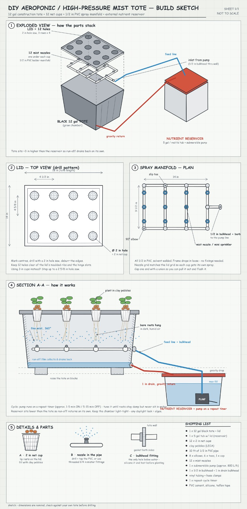
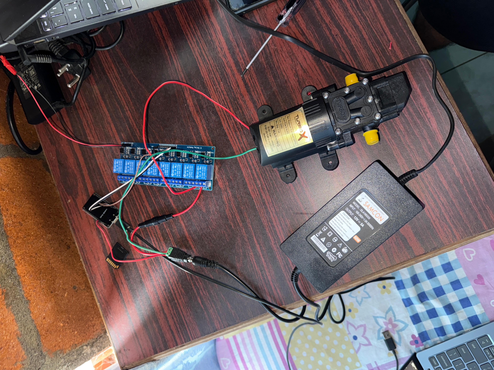
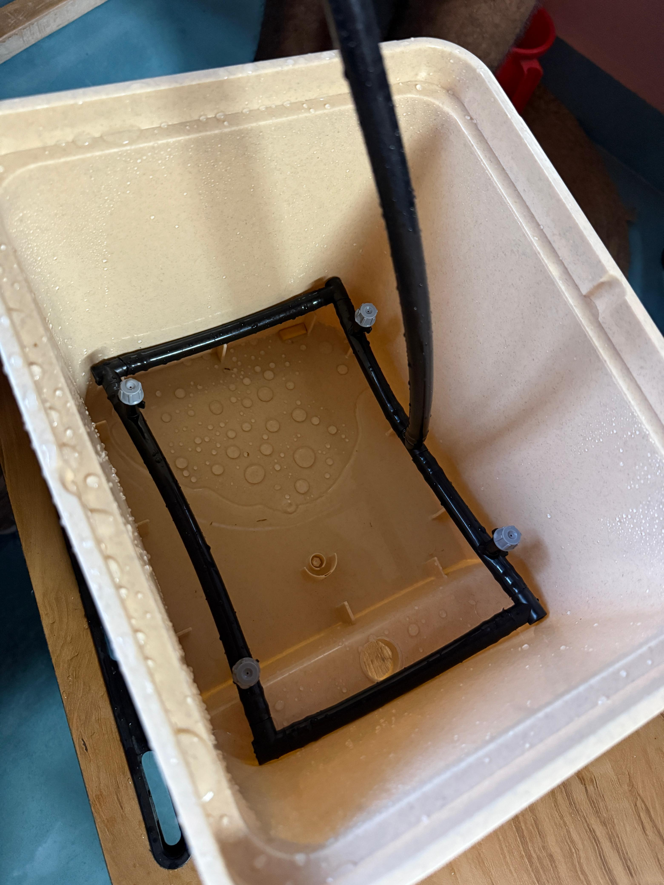
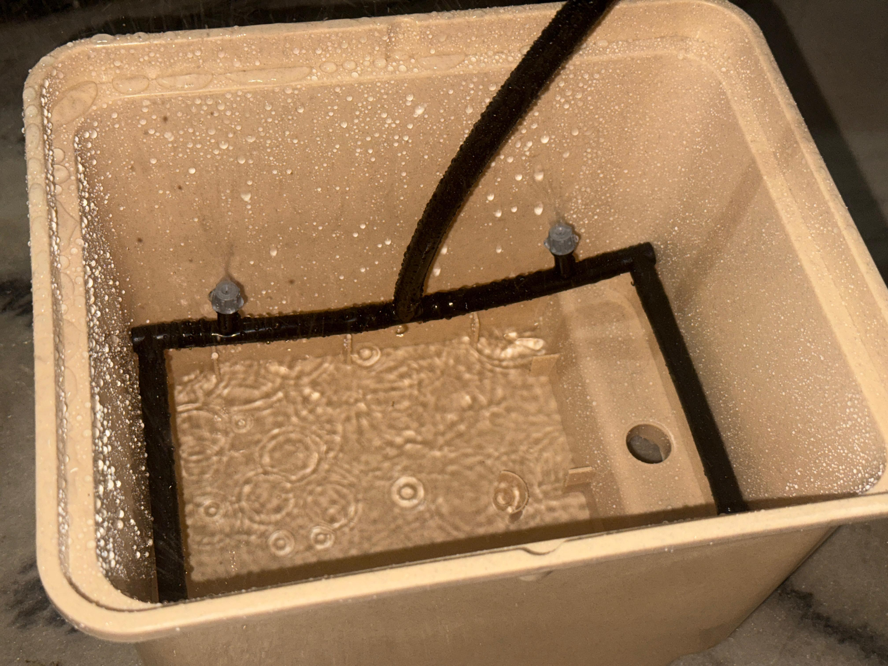

# Controlled Aeroponic Nutrient Experiment

This experiment evaluates plant growth under controlled aeroponic conditions while varying the presence or absence of three nutrients. An ESP32 controls the misting cycle and switches the irrigation hardware through an 8-channel relay module. Plant images are collected as a time series for later analysis and model evaluation.

## Documentation images

### System concept



The sketch shows the grow chamber, nutrient reservoir, spray manifold, return path, and plant positions.

### Controller and pump assembly



The hardware assembly includes the ESP32 controller, 8-channel relay module, 12 V pump, and DC power supply.

### Spray manifold



The manifold distributes the nutrient solution to the mist sprayers inside the grow chamber.

### Misting operation



The spray pattern and coverage should be checked before starting a growth run.

## Hardware stack

| Subsystem | Specification |
| --- | --- |
| Controller | ESP32 |
| Switching | 8-channel relay module |
| Power | 12 V, 10 A DC adapter |
| Actuators | 8 x 12 V diaphragm pumps, rated to 125 PSI |
| Growth chambers | 8 Dutch buckets with mist sprayers |
| Control logic | Misting cycle driven by ESP32 firmware |

### Functional arrangement

1. The ESP32 runs the misting-cycle firmware.
2. The ESP32 drives the relay inputs; the relay module switches the pump loads.
3. The 12 V DC supply powers the pump and relay power side according to the module wiring requirements.
4. Each Dutch bucket receives mist through its assigned sprayer or spray line.
5. The nutrient solution is delivered to the root zone and returned to the reservoir where applicable.

> **Electrical safety:** Confirm the pump, relay, adapter, and wiring ratings before energizing the system. Keep low-voltage control wiring isolated from exposed liquid, use appropriate fusing and insulation, and verify polarity and common-ground requirements for the selected relay board. Do not operate damaged or leaking equipment.

## Experimental design

### Nutrient factors

Three nutrients are treated as independent binary factors:

- **A - Calcium nitrate**
- **B - Potassium sulphate**
- **C - Ammonium phosphate**

Each factor is either absent (`0`) or present (`1`). The full factorial design therefore contains $2^3 = 8$ treatment combinations.

| Treatment code | Calcium nitrate (A) | Potassium sulphate (B) | Ammonium phosphate (C) |
| --- | ---: | ---: | ---: |
| `000` | 0 | 0 | 0 |
| `001` | 0 | 0 | 1 |
| `010` | 0 | 1 | 0 |
| `011` | 0 | 1 | 1 |
| `100` | 1 | 0 | 0 |
| `101` | 1 | 0 | 1 |
| `110` | 1 | 1 | 0 |
| `111` | 1 | 1 | 1 |

Use the same code in plant labels, solution records, image filenames, and model metadata. Record the actual concentration or dose for every nutrient used in a treatment; the binary code identifies inclusion only and does not define dosage.

### Controlled variables

Keep the following conditions consistent across treatments:

- Seed source and seed age
- Number and initial condition of plants per bucket
- Bucket and sprayer configuration
- Misting schedule and pump operating conditions
- Growing environment, including light, temperature, and humidity where possible
- Reservoir volume, solution preparation procedure, and maintenance schedule
- Image capture position, camera settings, background, and lighting

### Plant groups

- **Experimental plants:** assigned to one of the eight nutrient combinations.
- **Test plants:** kept separate from model training and tuning and used only for final evaluation.

Do not mix images from the test group into training or validation data. Record the plant identifier, treatment code, bucket identifier, and capture timestamp with every image.

## Experimental workflow

1. Prepare and label eight treatment groups using the codes in the table above.
2. Use seeds from the same source and establish plants under the same starting conditions.
3. Prepare each nutrient solution using the predefined concentration protocol and record the batch details.
4. Inspect the pumps, relay channels, tubing, sprayers, reservoir, and return path before starting the controller.
5. Upload and verify the ESP32 firmware. Confirm that each relay channel controls the intended actuator and that the misting cycle behaves as expected.
6. Place plants in their assigned Dutch buckets and start the controlled growth period.
7. Capture images throughout growth at a fixed schedule and from a consistent viewpoint.
8. Log environmental conditions, misting events, solution changes, anomalies, and plant observations.
9. Keep the held-out test plants and their images separate until model evaluation.
10. At the end of the run, export the image and metadata records together with the treatment and hardware logs.

## Firmware and misting configuration

The firmware should define and document at least:

- Relay-to-bucket or pump channel mapping
- Misting `ON` duration: **record value here**
- Misting `OFF` duration: **record value here**
- Startup state for every relay
- Recovery behavior after reset or power loss
- Manual test mode for individual channels
- Any watchdog, fault, or timeout behavior

Before a growth run, test each channel with the pumps disconnected or with a safe water-only setup. Confirm that the actual spray coverage matches the intended bucket assignment.

## Imaging and data organization

Capture plant images at the same stage and cadence across treatments. Avoid changing camera distance, lens, lighting, or background during a run unless the change is recorded.

A practical metadata record for each image is:

| Field | Example |
| --- | --- |
| `image_id` | `2026-09-06_0001` |
| `plant_id` | `P03` |
| `bucket_id` | `B05` |
| `treatment_code` | `101` |
| `capture_time` | ISO 8601 timestamp |
| `growth_day` | Day 12 |
| `camera_setup` | Fixed camera position identifier |
| `notes` | Visible stress, obstruction, or anomaly |

Keep a dataset split based on plants, not individual images, so images from one plant cannot appear in both training and evaluation sets.

## Reproducibility checklist

- [ ] All eight treatment codes are assigned and labelled.
- [ ] Nutrient concentrations and solution batches are recorded.
- [ ] Pump and relay channel mapping is documented.
- [ ] Misting on/off durations are recorded.
- [ ] Seed source and planting dates are recorded.
- [ ] Environmental conditions are logged.
- [ ] Image timestamps and plant identifiers are present.
- [ ] Test plants are excluded from training and tuning.
- [ ] Hardware checks and anomalies are recorded.

## Repository layout

```text
docs/
├── README.md
├── internal_setup.jpeg
├── pump.jpeg
├── setup.jpeg
└── sprinkling.jpeg
```

## Current scope

This document describes the physical setup and experimental design. Add the ESP32 firmware, nutrient preparation calculations, image metadata files, and analysis scripts as they become available.

